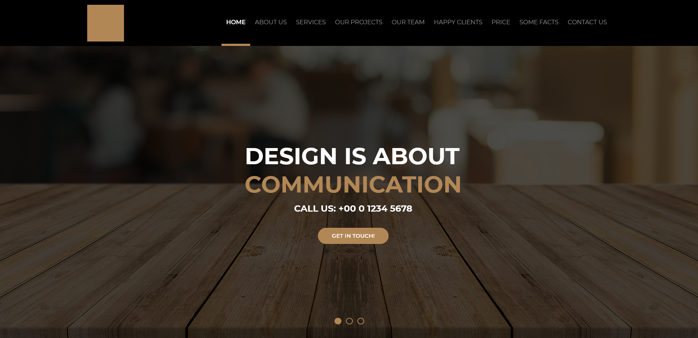

#AWAX

<p align="center">
  <a href="#Project">Project</a>&nbsp;&nbsp;&nbsp;|&nbsp;&nbsp;&nbsp;
  <a href="#-Technologies">Technologies</a>&nbsp;&nbsp;&nbsp;|&nbsp;&nbsp;&nbsp;
  <a href="#-Getting started">Getting started</a>&nbsp;&nbsp;&nbsp;|&nbsp;&nbsp;&nbsp;
  <a href="#-Layout">Layout</a>
</p>

<br>

<h1 align="center">
    
</h1>

<br>

---

## 💻 Project

Is a Website to train HTML and CSS responsiveness for desktop, tablet and mobile devices!


## 🧪 Technologies

This project was developed using the following technologies:
 
- [HTML](https://devdocs.io/html/)
- [CSS](https://devdocs.io/css/)

## 🚀 Getting started

Clone the project and access the folder.

```bash
$ git clone https://github.com/MaykonRaphael/Awax.git
$ cd Awax
```
Then open the index.html file in your browser!

## 🔖 Layout
###Desktop
<h1 align="center">
    
</h1>

###Mobile
<h1 align="center">
    
</h1>

---
<p align="center">
  Made by Maykon Raphael 👋
</p>